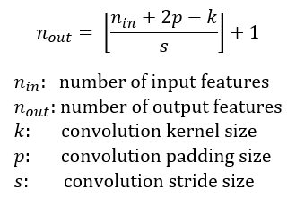
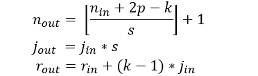
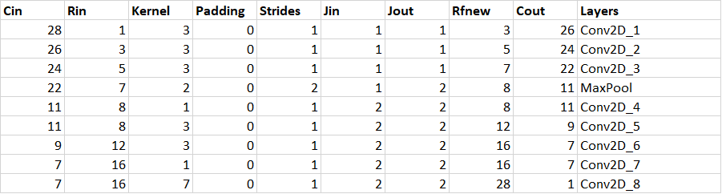
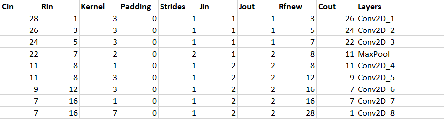
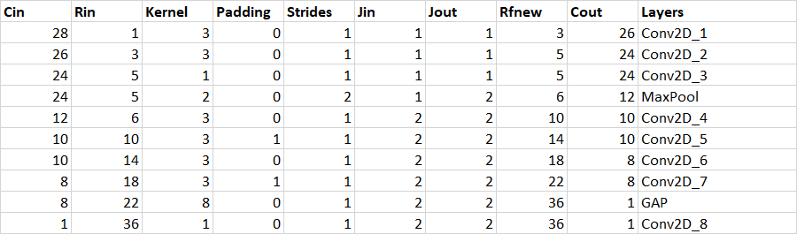

# Incremental Convolutional Neural Network Design & Optimizations.

**Receptive Field Calculation:**
```
Cin - Input Image Dimension
Rin - Initial Receptive field
Kernel - Size of kernel
Padding - Padding size 
Jin - Jump in
Jout - Jump output
RFnew - New Receptive field
Cout - Output Image dimension after convolution
Layers - Layer name
``` 




## Optimization Step-1

**Target:**
- Setup Initial code, dataset loaders, transformation etc.
- Structure the code and get the training and validation loop operational.
- Train for less than 15 epochs, apply normalization on both train and test dataset as a transformation.
- Initial batch_size = 128 

**Result:**
- Total Parameters: 1,94,884
- Train Accuracy: 99.23% (Epoch - 13)
- Test Accuracy: 98.92% (Epoch - 13)

**Analysis:**
- Slight underfiting at start of the epoch and slight overfitting by the end of the epoch.
- Too many parameters.



## Optimization Step-2

**Target:**
- Primary focus is to get the number of model parameters down to less than 20k without losing much on the model's accuracy. 

**Result:**
- Total Parameters: 10,790
- Train Accuracy: 99.36% (Epoch - 13)
- Test Accuracy: 98.88% (Epoch - 13)

**Analysis:**
- Similar accuracy compared to that of Step-1 but with a drastic reduction in total number of parameters. 
- Any further reduction in parameters could restrict the model's learnability due to capacity limitations.
- Now is the right time to apply further non-architectural optimizations. 



## Optimization Step-3


**Target:**
- Apply Batch Normalization, Global Average Pooling and initial dropout of 25%

**Result:**
- Total Parameters: 6070
- Train Accuracy: 98.55% (Epoch - 14)
- Test Accuracy: 98.43% (Epoch - 14)

**Analysis:**
- No overfitting this time around.
- Train and Test Accuracy has reduced slightly compared to that of Step-1 and Step-2 but with a drastic reduction in total number of parameters which is now 6,070.
- Batch Normalization, GAP and dropout has helped preserve almost similar accuracy with slight reduction in total number of parameters but the target of accuracy >= 99.4% isn't achieved yet.
- Need to increase parameter count upto 8k and try other techniques like Image augmentation and/or learning rate scheduler.


## Optimization Step-4

**Target:**
- Apply data augmentation Random Rotation (5 degree) and Learning rate scheduler with initial learning rate of 0.7 with step size of 5. 
- Apply dropout after each convolution block but with the reduced dropout value from 25% to 1%.

**Result:**
- Total Parameters: 7,624
- Train Accuracy: 99.31% (Epoch - 12)
- Test Accuracy: 99.49% (Epoch - 12)

**Analysis:**
- Train and Test Accuracy has increased drastically compared to that of Step-1, Step-2 and Step-3 but with a total number of parameters which is now 7,624 (<= 8,000).
- We have achieved accuracy >= 99.4% consistently with parameters <= 8,000.


